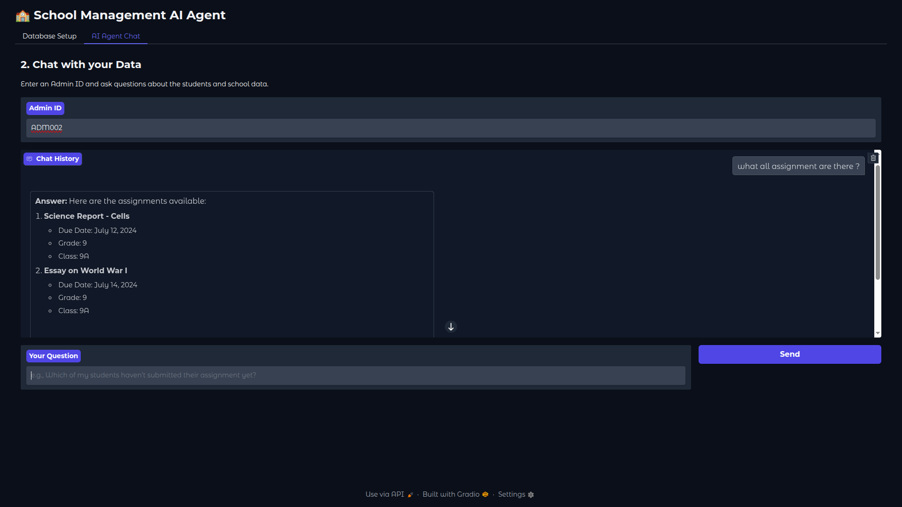
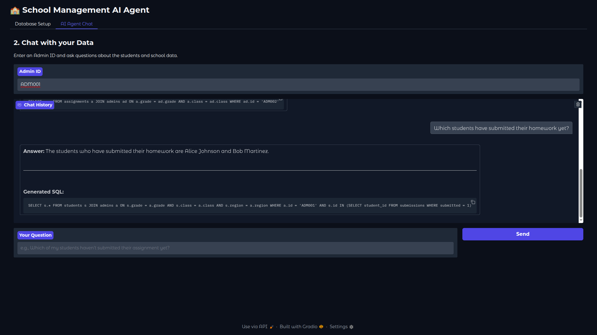

# Natural Language Database Query System

This project is a technical assessment demonstrating a system that allows users to query a database using natural language. It features a simple web interface where a user, acting as an administrator, can ask questions about school data and receive user-friendly answers.

The system leverages Large Language Models (LLMs) via LangChain for natural language understanding and SQL generation, with a Gradio interface for user interaction.

## ✨ Features

*   **Data Ingestion:** Easily populates a local SQLite database from a single JSON file.
*   **Natural Language Querying:** Users can ask complex questions in plain English.
*   **Role-Based Access Control:** Queries are automatically filtered based on the provided `admin_id`, ensuring users only see data they are permitted to access.
*   **Structured Output:** Uses Pydantic and LangChain's structured output features to ensure reliable SQL generation.
*   **Intelligent Prompt Engineering:** The prompt is carefully crafted with rules and examples to produce accurate and safe SQL queries.
*   **Interactive Web UI:** A simple Gradio app provides a user-friendly interface for data setup and chatting with the AI agent.

## 🛠️ Tech Stack

*   **Backend:** Python
*   **LLM Framework:** LangChain
*   **AI Model:** OpenAI (e.g., GPT-4o)
*   **Database:** SQLite
*   **Web UI:** Gradio

## 📁 Project Structure

The project is organized into the following files:

```
.
├── data_manager.py     # Handles database creation and data ingestion
├── query_system.py     # Contains the AI agent logic for NL-to-SQL
├── main.py             # Runs the Gradio web application
├── dataset.json        # The source data for students, admins, etc.
└── .env                # For storing environment variables (API keys)
```

## ⚙️ How It Works

The system operates in three main stages:

### 1. Data Ingestion (`data_manager.py`)

*   The `DatabaseManager` class is responsible for all database interactions.
*   It reads the artificially generated `dataset.json` file.
*   It dynamically creates a local SQLite database with the necessary tables (`students`, `admins`, `assignments`, `submissions`, etc.) and defines their schemas.
*   It populates these tables with the data from the JSON file.
*   A special method, `get_schema_representation`, generates a text description of the database schema and key relationships, which is then fed to the LLM as context.

### 2. Query System (`query_system.py`)

*   The `QueryAgent` class uses an LLM from LangChain to power its logic.
*   When a user asks a question, the agent combines the question, the database schema, and the `admin_id` into a carefully engineered prompt.
*   The LLM processes this prompt and generates a SQL query as a structured output.
*   The agent then executes this SQL query on the SQLite database.
*   Finally, the raw data returned from the database is used to generate a user-friendly, natural language answer.

### 3. User Interface (`main.py`)

*   A simple web application is built using the Gradio library.
*   The interface has two tabs:
    1.  **Data Setup:** Allows the user to upload the `dataset.json` file to populate the database.
    2.  **AI Chat:** Provides a chatbot-style interface where the user enters their `admin_id` and can start asking questions.

## 🚀 Setup and Usage

Follow these steps to run the application locally.


### 1. Installation


1.  **Install dependencies:**
    ```bash
    pip install -r requirements.txt
    ```

2.  **Set up environment variables:**
    Create a file named `.env` in the root directory and add your OpenAI API key:
    ```
    OPENAI_API_KEY="sk-..."
    ```

### 3. Running the Application

1.  **Launch the Gradio app:**
    ```bash
    python main.py
    ```

2.  **Use the web interface:**
    *   Open the URL provided in the terminal (usually `http://127.0.0.1:7860`).
    *   Navigate to the **Database Setup** tab, upload your `dataset.json` file, and click "Populate Database".
    *   Navigate to the **AI Agent Chat** tab.
    *   Enter a valid `admin_id` (e.g., `ADM001`) and start asking questions!

## 🧪 Sample Scenarios

Here are some sample questions and the expected correct answers for different admin users.

### Scenario 1: `admin_id = ADM001`
*(This admin has access to Grade 8, Class 8A in the North region)*

| Question                                    |  Correct Answer                 | is_correct|
| ------------------------------------------- | --------------------------------------- |---|
| "Which students have submitted their homework?" | Alice Johnson and Bob Martinez          |yes|
| "which quiz are there?"                     | Science Quiz - Photosynthesis           |yes|
| "which student has the high score on an assignment?" | Bob Martinez, who is in class 8A      |yes|

### Scenario 2: `admin_id = ADM002`
*(This admin has access to Grade 9, Class 9A in the South region)*

| Question                                    |  Correct Answer                 |is_correct|
| ------------------------------------------- | --------------------------------------- |---|
| "Which students have submitted their homework?" | David Kim                               |yes|
| "Which all assessments are there?"          | Science Report - Cells, Essay on World War I |yes|

## Screenshots


